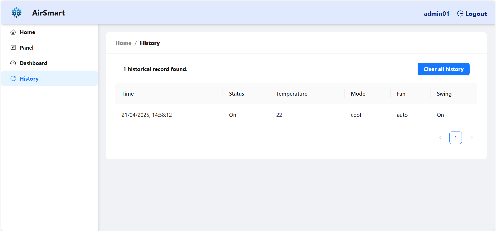
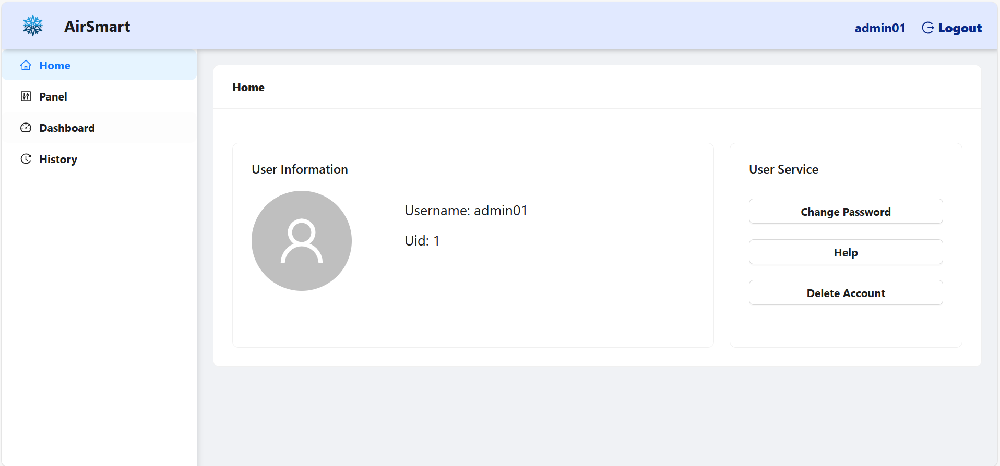
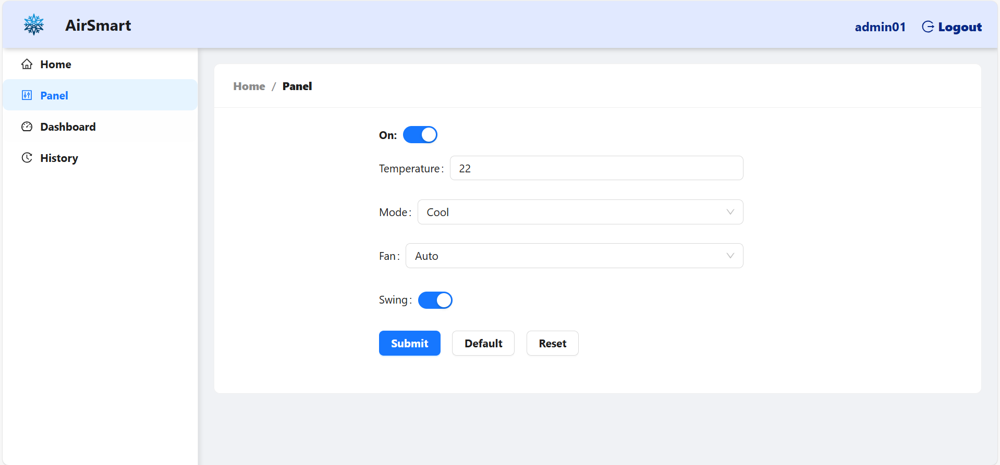
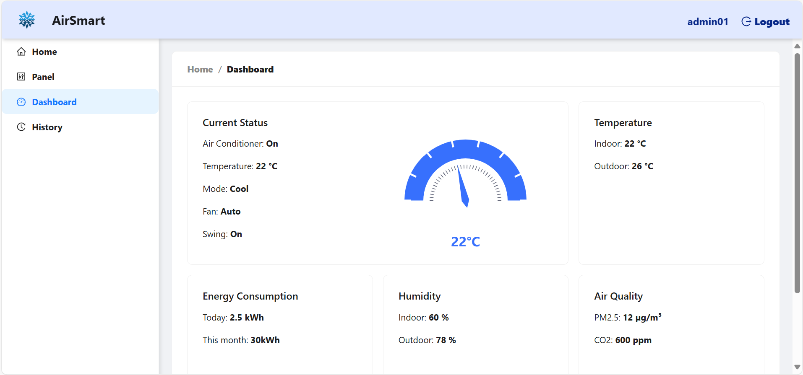

## AirSmart -- An AI-driven HVAC System

A full-stack solution combining **React-based monitoring UI** and **AI-driven HVAC control algorithms**, designed to reduce energy consumption in property management companies.

# Preview
Login Page:

Home Page:

Panel Page:

Dashboard Page:

History Page:

For detailed information regarding the construction and training of the AI model, please refer to the ./ai-model/AirSmart_final.ipynb file.

# Feature:
## Web Application:
- **Real-time temperature control** with interactive UI
- **JWT authentication** for authorized users, such as admin
- **Real-time Air Conditioner Status Display** using Chart.js
- **RESTful API** for seamless frontend-backend communication
- **Responsive design** powered by Ant Design

## AI:
- Python-based training pipeline (Google Colab Notebook available in `/ai-models`)
- **BiLSTM model** for weather forecast
- **AC model** for automatic control of HVAC system based on sensor data and weather forecast data

## Future Scope  
- Real-time sensor data integration with IoT devices  
- Automated API pipeline between frontend and AI models

# Tech Stack:
## Frontend
- React 18
- Ant Design (UI components)
- Axios (HTTP requests)
- Chart.js (data visualization)

## Backend
- Node.js (Express)
- JWT (authentication)
- RESTful API design

## Tools
- Git (version control)
- Postman (API testing)

# Project Structure
.
├── client/ # Frontend code
│ ├── public/ # Static assets
│ └── src/
│ ├── apis/ # API service layer
│ ├── components/ # Reusable components
│ ├── pages/ # Route-level components
│ ├── store/ # State management
│ ├── utils/ # Utility functions
│ └── router/ # Routing configuration
└── server/ # Backend code
  └── utils/ # Utility modules

# Getting Start
## Prerequisites
- Node.js (v16+)
- npm (v8+)

# Installation
1. Clone the repository:
    git clone [https://github.com/cherry-lcy/air-conditioner-platform.git](https://github.com/cherry-lcy/AirSmart)

2. Install dependencies
    Frontend:
        cd client
        npm install
    Backend:
        cd ../server
        npm install

3. Running locally
    Backend:
        cd server
        npm start

        API will run on http://localhost:5000

    Frontend:
        cd client
        npm run dev

        APP will run on http://localhost:3000

    * You may login with admin account(username: admin01, password: 123456).

# API description
BaseURL: http://localhost:5000
Get     /user/profile                       Get user information
Get     /control/history                    Get historical record
Post    /authorization                      User authentication
Post    /control                            Air conditioner remote control
Delete  /control/history                    Delete all historical record

Get     Hong Kong Observatory Weather API   Real-time update of outdoor weather condition
